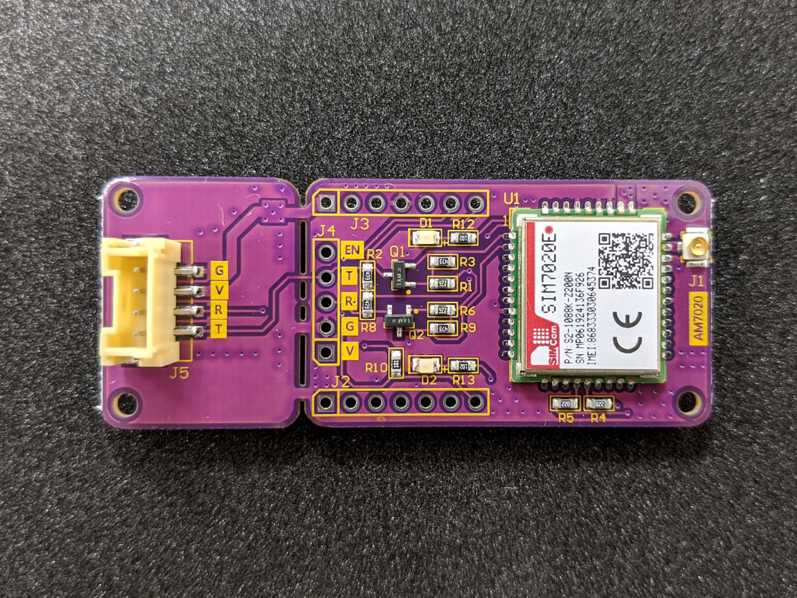

# AM7020 MQTT(S)/HTTP(S) Arduino Library
 [AM7020](https://atticedu.com/index.php/am7020.html) (SIMCOM SIM7020E) MQTT(S), HTTP(S) Library(Protocol Stack on SIM7020E)
 
 ## AM7020
 Declare nbiot instance using:
```C++
#define SerialAT       Serial2
#define AM7020_RESET   5
SIM7020NB nb(SerialAT, AM7020_RESET);
```
Initialize nb and connect to NBIOT base station:
```C++
void nbConnect(void)
{
    Serial.println(F("Initializing modem..."));
    while (!nb.init() || !nb.nbiotConnect(APN, BAND)) {
        Serial.print(F("."));
    }; 
    Serial.print(F("Waiting for network..."));
    while (!nb.waitForNetwork()) {
        Serial.print(F("."));
        delay(5000);
    }
    Serial.println(F(" success"));
}
```
Check NBIOT connection status:
```C++
if (!nb.chkNet()) {
nbConnect();
}
```
## MQTT(S)
Declare instance using:<br/>
* MQTT
```C++
SIM7020EMQTT  mqtt(SerialAT);
```
* MQTTS<br/>
You can use the openssl command to get the Server CA.
```console
openssl s_client -connect {HOSTNAME}:{PORT} -showcerts
```
```C++
const char root_ca[] PROGMEM = {"-----BEGIN CERTIFICATE-----\\r\\n"
                                "MIIEAzCCAuugAwIBAgIUBY1hlCGvdj4NhBXkZ/uLUZNILAwwDQYJKoZIhvcNAQEL\\r\\n"
                                ...
                                "-----END CERTIFICATE-----"};
SIM7020EMQTTS mqtts(SerialAT, root_ca);
```
Publish and subscribe:
```C++
mqtt.publish(MQTT_TOPIC, message);

void callback(const char *msg)
{
    Serial.print(MQTT_TOPIC ": ");
    Serial.println(msg);
}
mqtt.subscribe(MQTT_TOPIC, callback);
```
Listen for messages from the broker:
```C++
mqtt.procSubs();
```
## HTTP(S)
Declare instance using:<br/>
* HTTP
```C++
SIM7020EHTTP  http(SerialAT, HTTP_SERVER);
```
* HTTPS<br/>
You can use the openssl command to get the Server CA.
```console
openssl s_client -connect {HOSTNAME}:{PORT} -showcerts
```
```C++
const char root_ca[] PROGMEM = {"-----BEGIN CERTIFICATE-----\n"
                                "MIIEdTCCA12gAwIBAgIJAKcOSkw0grd/MA0GCSqGSIb3DQEBCwUAMGgxCzAJBgNV\n"
                                ...
                                "-----END CERTIFICATE-----"};
SIM7020EHTTPS https(SerialAT, HTTP_SERVER, root_ca);
```
HTTP Get and Post:
```C++
http.get(HTTP_GET_API);
http.post(HTTP_POST_API, "application/json", "{\"value\": \"POST\"}");
```